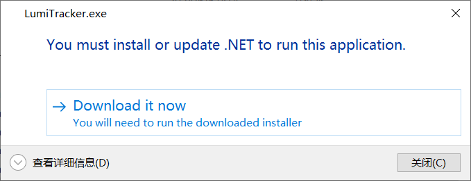
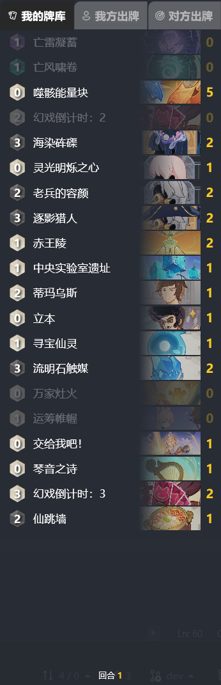

# LumiTracker - 七圣召唤记牌器

中文 | [English](README_en.md) | [说明文档](https://uex8no0g44.feishu.cn/docx/SBXZdiKNvoXeSrxgfpccuIvVnAe)

## 功能

- [ ] 对局记录
  - [x] 己方/对方打出的手牌
  - [x] 过牌
  - [ ] 弃牌
  - [ ] 调和牌
  - [x] 往牌库里塞牌
- [x] 对局前导入牌组，对局中展示牌库剩余卡牌
- [x] 段位查询
- [x] 回合数记录
- [ ] 伤害计算

---

- [ ] 多语言支持
- [x] 应用内更新
- [x] 云原神支持

## 运行环境

- 64 位 Windows 10 或 Windows 11
- [.NET 8.0 运行时](https://dotnet.microsoft.com/zh-cn/download/dotnet/8.0/runtime)

## 常见问题

**1. 启动游戏时弹窗报错**

安装[.NET 8.0 运行时](https://dotnet.microsoft.com/zh-cn/download/dotnet/8.0/runtime)后即可运行，点击确认后会自动安装

**2. 双击程序后没反应，系统托盘图标闪退**

请尝试以管理员身份运行

## 截图
- 卡组配置界面

- 对局内界面

## 参考

- [ImageHash](https://github.com/JohannesBuchner/imagehash)
- [Windows Capture](https://github.com/NiiightmareXD/windows-capture)
- [Annoy](https://github.com/spotify/annoy)
- [WPF UI](https://github.com/lepoco/wpfui)
- [Fluent UI System Icons](https://github.com/microsoft/fluentui-system-icons)
- [Inno Setup](https://jrsoftware.org/isinfo.php)
- [Swordfish.NET.CollectionsV3](https://github.com/stewienj/SwordfishCollections)