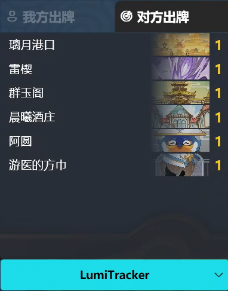

# LumiTracker

```
<div align="center">
  <a href="https://dotnet.microsoft.com/zh-cn/download/dotnet/latest/runtime"></a>
</div>
```

七圣召唤记牌器



## 功能

- [ ] 记录已打出的手牌
- [ ] 段位查询
- [ ] 伤害计算

---

- [ ] 多语言支持
- [ ] 应用内更新
- [ ] 云原神支持

## 运行环境

- 64 位 Windows 10 或 Windows 11
- [.NET 8.0 运行时](https://dotnet.microsoft.com/zh-cn/download/dotnet/8.0/runtime)

## 常见问题

- 启动游戏时报错


请点击确认，安装[.NET 8.0 运行时](https://dotnet.microsoft.com/zh-cn/download/dotnet/8.0/runtime)后即可运行

- 双击程序后没反应，系统托盘图标闪退

尝试以管理员身份运行

## 参考

- [ImageHash](https://github.com/JohannesBuchner/imagehash)
- [Windows Capture](https://github.com/NiiightmareXD/windows-capture)
- [Annoy](https://github.com/spotify/annoy)
- [WPF UI](https://github.com/lepoco/wpfui)
- [Fluent UI System Icons](https://github.com/microsoft/fluentui-system-icons)
- [Inno Setup](https://jrsoftware.org/isinfo.php)