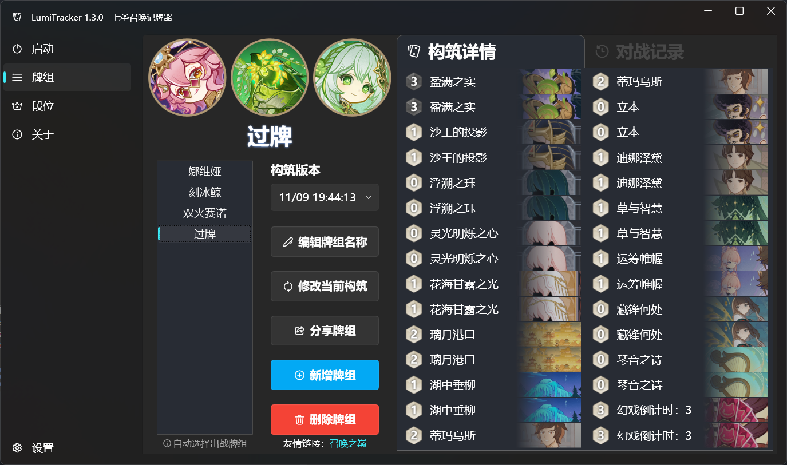
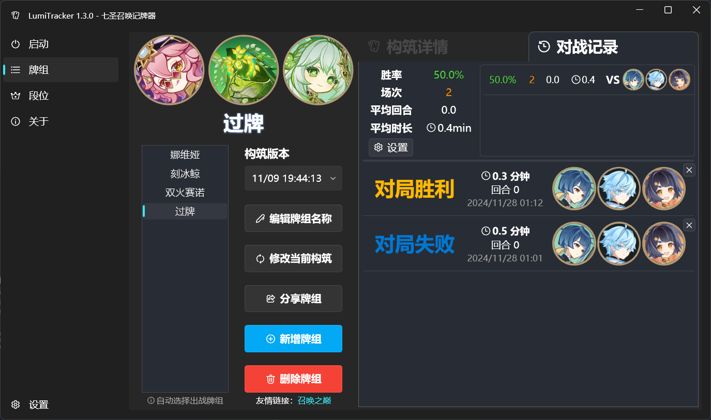
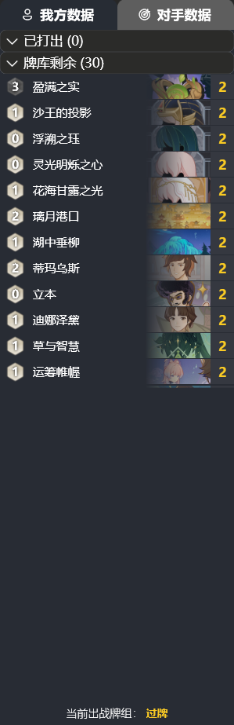

# LumiTracker - 七圣召唤记牌器

中文 | [English](README_en.md) | [说明文档](https://uex8no0g44.feishu.cn/docx/SBXZdiKNvoXeSrxgfpccuIvVnAe)

[功能演示（视频）](https://www.bilibili.com/video/BV19NxhecEFV)

## 功能

- [ ] 卡牌行为检测
  - [x] 己方/对方打出的手牌
  - [x] 过牌
  - [x] 往牌库里塞牌
  - [ ] 弃牌
  - [ ] 调和牌
- [ ] 牌库记录
  - [x] 已打出
  - [x] 剩余卡牌
  - [ ] 牌库顶
- [x] 牌组导入
- [x] 回合数记录
- [x] 段位查询
- [ ] 伤害计算

---

- [x] 多语言支持
  - [x] 简体中文
  - [x] 英语
  - [x] 日语
- [x] 应用内更新
- [x] 云原神支持

## 运行环境

- 64 位 Windows 10 或 Windows 11
- [.NET 8.0 运行时](https://dotnet.microsoft.com/zh-cn/download/dotnet/8.0/runtime)

## 截图

- 牌组界面

- 记牌界面

## 参考

- [ImageHash](https://github.com/JohannesBuchner/imagehash)
- [Windows Capture](https://github.com/NiiightmareXD/windows-capture)
- [Annoy](https://github.com/spotify/annoy)
- [WPF UI](https://github.com/lepoco/wpfui)
- [Fluent UI System Icons](https://github.com/microsoft/fluentui-system-icons)
- [Inno Setup](https://jrsoftware.org/isinfo.php)
- [Swordfish.NET.CollectionsV3](https://github.com/stewienj/SwordfishCollections)

## 致谢
感谢[@豆沙包](https://space.bilibili.com/771364)在日语翻译中提供的帮助！

特别感谢以下开源项目，对本项目给予了极大的启发：
- [Hearthstone-Deck-Tracker](https://github.com/HearthSim/Hearthstone-Deck-Tracker)
- [BetterGI](https://github.com/babalae/better-genshin-impact)
- [Starward](https://github.com/Scighost/Starward)