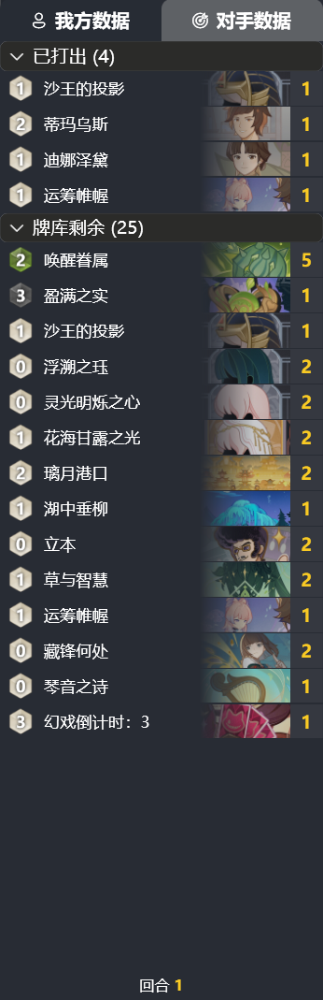

# LumiTracker - Genshin Impact TCG Tracker

[中文](README.md) | English | [Documentation](https://uex8no0g44.feishu.cn/docx/SBXZdiKNvoXeSrxgfpccuIvVnAe)

[Overview Video](https://www.bilibili.com/video/BV19NxhecEFV)

## Features

- [ ] Card Behaviors
  - [x] My/Opponent's played cards
  - [x] Drawn cards
  - [x] Created cards placed into the deck
  - [ ] Discarded cards
  - [ ] Elemental tuned cards
- [ ] Deck Tracking
  - [x] Played
  - [x] In Deck
  - [ ] Deck Top
- [x] Import Deck from share code
- [x] Round Detection
- [x] Show Ranking
- [ ] Damage Calculation

---

- [x] Multi-language support
  - [x] Chinese Simplified
  - [x] English
  - [x] Japanese
- [x] In-app updates
- [x] Support for Genshin Impact Cloud Game

## System Requirements

- 64-bit Windows 10 or Windows 11
- [.NET 8.0 Runtime](https://dotnet.microsoft.com/en-us/download/dotnet/8.0/runtime)

## Screenshots

- Deck Import Page

- Deck Record Window

## References

- [ImageHash](https://github.com/JohannesBuchner/imagehash)
- [Windows Capture](https://github.com/NiiightmareXD/windows-capture)
- [Annoy](https://github.com/spotify/annoy)
- [WPF UI](https://github.com/lepoco/wpfui)
- [Fluent UI System Icons](https://github.com/microsoft/fluentui-system-icons)
- [Inno Setup](https://jrsoftware.org/isinfo.php)
- [Swordfish.NET.CollectionsV3](https://github.com/stewienj/SwordfishCollections)

## Acknowledgments
Thanks to [@豆沙包](https://space.bilibili.com/771364) for the help with Japanese translation!

A special thanks to the following open-source projects for providing significant inspiration to this project:

- [Hearthstone-Deck-Tracker](https://github.com/HearthSim/Hearthstone-Deck-Tracker)
- [BetterGI](https://github.com/babalae/better-genshin-impact)
- [Starward](https://github.com/Scighost/Starward)